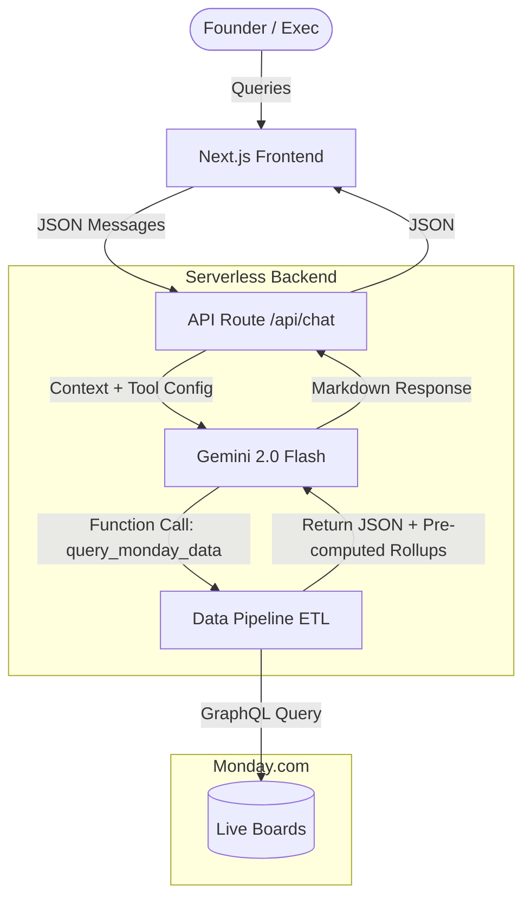

# Skylark Drones - Business Intelligence Agent

An AI-powered conversational agent that connects to Monday.com boards to answer founder-level business queries about sales pipelines and work orders.

## Architecture
The application uses a modern Next.js stack connected to Google Gemini and Monday.com.



1. **Frontend**: A clean, responsive chat interface built with React and vanilla CSS.
2. **API Route**: A serverless route (`/api/chat`) that securely handles communication.
3. **Agent**: Powered by Google Gemini 2.0 Flash, configured with specific system prompts to handle business intelligence queries and gracefully communicate data quality issues.
4. **Data Pipeline**: A custom ETL layer that fetches live data from Monday.com, cleans it (strips header leaks, normalizes statuses, parses mixed-unit quantities), and joins Deals to Work Orders based on Deal Name.
5. **Monday.com API**: Integration via GraphQL for real-time read-only data access.

## Setup Instructions

### 1. Monday.com Configuration
To ensure the pipeline works perfectly, you must correctly map the column types when importing the data:
1. Import the provided files (`Deal funnel Data.xlsx` and `Work_Order_Tracker Data.xlsx`) as two separate new boards.
2. **Column Type Mappings:**
   - **Text / Name:** Deal Name, Client Code, Customer Name
   - **Numbers:** Currency fields (e.g., Deal Value, Billed Amount) should be imported as the "Numbers" type. This ensures Monday.com handles the formatting internally and prevents currency symbols (`$`, `₹`) or commas from leaking into the raw text values.
   - **Status / Dropdown:** Categorical fields (Deal Stage, Deal Status, Execution Status, Sector/service) should be imported as "Status" or "Dropdown" types.
   - **Text:** Free-text fields with mixed units (e.g., Quantities as per PO) must remain as standard Text so our custom Regex parser can split the values from the units.
2. Obtain your Monday.com API Token:
   - Go to your Monday.com account.
   - Click on your profile picture -> Developers -> My Access Tokens.
   - Generate and copy a new token.
3. Obtain your Board IDs:
   - Open each board in your browser.
   - The Board ID is the numeric value at the end of the URL (e.g., `.../boards/123456789`).

### 2. Environment Variables
Create a `.env.local` file in the root of the project with the following keys:

```env
MONDAY_API_KEY=your_monday_token_here
MONDAY_BOARD_ID_DEALS=your_deals_board_id_here
MONDAY_BOARD_ID_WORK_ORDERS=your_work_orders_board_id_here
GEMINI_API_KEY=your_google_gemini_api_key_here
```

### 3. Local Development
1. Install dependencies:
   ```bash
   npm install
   ```
2. Start the development server:
   ```bash
   npm run dev
   ```
3. Open [http://localhost:3000](http://localhost:3000) in your browser.

## Dealing with Messy Data
This application includes a custom data pipeline to handle real-world messiness present in the raw data:
- **Header Leaks:** Dynamically detects and strips rows where column headers leaked into the data (e.g., `Deal Stage` == "Deal Stage").
- **Quantity Parsing:** Extracts numeric values and units from free-text fields (e.g., "5360 HA", "1250 towers").
- **Orphaned Records:** Handles the ~10% of Work Orders that do not have a matching Deal.
- **Client Codes:** Acknowledges that `WOCOMPANY_xxx` and `COMPANYxxx` do not overlap, forcing joins to occur on Deal Name.
